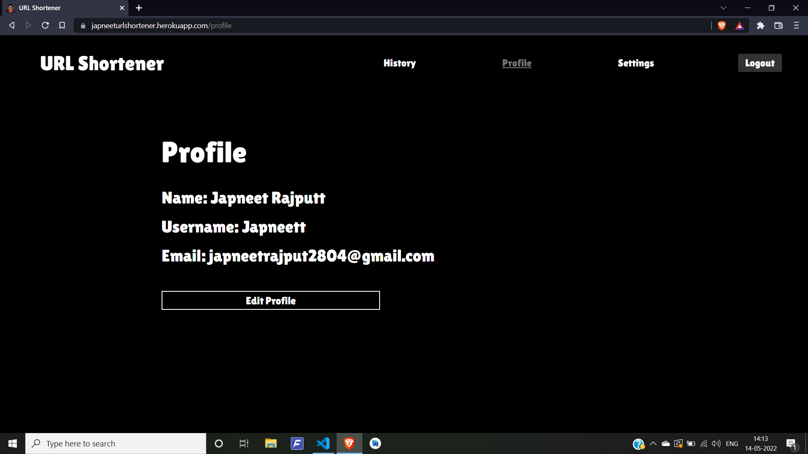

# Developer Details

[Japneet Rajput](https://github.com/JapneetRajput) 

[Portfolio Website](https://japneetrajput.github.io)

# Development
Please have python3 installed to run this project on terminal:
[Python3 Installation](https://www.python.org/downloads/)

# Project Title
A URL Shortener is a tool that creates a short, unique URL that will redirect to the specific website of your choosing

## Prerequisites
Modules used in this app are Flask and PyShortener.

Steps:

Start MySQL and Apache server on Xampp.

Initialize Database schema by going to MySQL Server admin page by passing the queries in initialize.sql

Install the Virtual Environment module

    pip install virtualenv

Create a virtual environment

    virtualenv venv

Activate the Virtual Environment

    venv\scripts\activate.bat

Install the required modules

    pip install -r requirements.txt

## How to run the project
<!--Remove the below lines and add yours -->
Steps:

Run the app 

    flask run

## Screenshots of the project
<!--Remove the below lines and add yours -->
Login/Register:

A user can create an account by registering and later use the credentials to login
to use our tool. Login/register credentials are stored in the MySQL database.

Url Shortener tool:

A user can shorten their(Long) Urls using our shortener tool by entering the url
and assigning a nickname to it So that later when he checks the history they’ll get to
know which link corresponds to which website.

History:

All the URLs shortened by a user are stored in the MySQL database which are
later displayed in the history section.

Profile:

This page shows the user details and the user has an option to update his profile.

